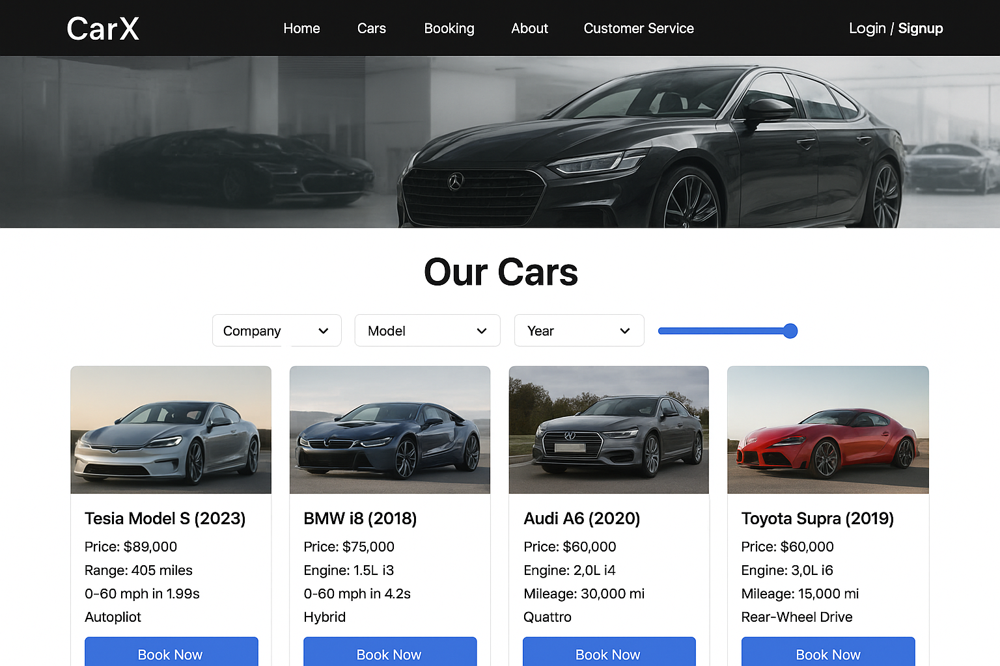
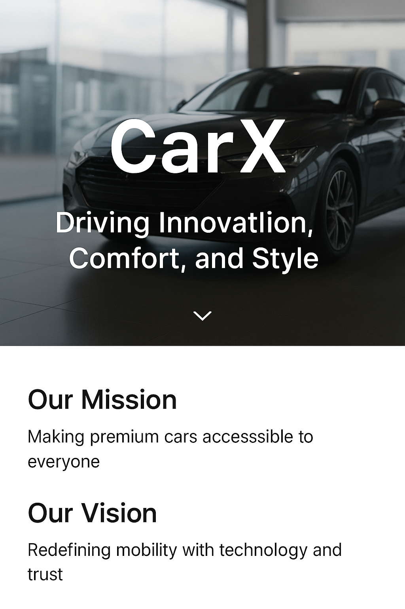

# 🚗 CarX – Driving Innovation, Comfort, and Style

Welcome to **CarX**, a premium car-selling platform built with the **MERN stack**, designed to give customers a **luxury showroom experience online**. From browsing dream cars to booking test drives, CarX is your gateway to **innovation, speed, and elegance on wheels**.

---

## 🌟 Key Features

* 🏠 **Homepage** → Stunning hero banner with **mission & vision**.
* 🚘 **Cars Section** → Browse **latest models** with images, specs, prices, and features.
* 🔍 **Smart Filters** → Search by **company, model, year, and price range**.
* 📝 **Booking Section** → Book test drives or schedule a visit effortlessly.
* ℹ️ **About Section** → Learn about CarX’s values, founders, and legacy.
* 📞 **Customer Support** → Rate services (1–10), write reviews, and access emergency numbers.
* 🔑 **Authentication** → Secure **Login/Signup** powered by **JWT** with backend integration.
* 📱 **Responsive Design** → Seamlessly optimized for desktop, tablet, and mobile.

---

## 🏗️ Website Sections

### 1️⃣ Homepage

* Company name: **CarX**.
* Background: Sleek **luxury car showroom image**.
* Mission: *“Making premium cars accessible to everyone.”*
* Vision: *“Redefining mobility with technology and trust.”*

📸 *Preview:*


---

### 2️⃣ Cars Section

* **Car cards** displaying:

  * Image of the model.
  * Specifications: Model, Year, Engine, Mileage, Price.
  * Key features (Autopilot, Hybrid, Quattro, etc.).
  * **Book Now button** to proceed to booking form.

* **Filters:**

  * Dropdown → Company, Model, Year.
  * Price Range → Slider for flexible searching.

📸 *Preview:*


---

### Example Car Card

```
🚗 Tesla Model S (2023)  
💰 Price: $89,000  
⚡ Range: 405 miles | 0-60 mph in 1.99s | Autopilot  
[Book Now]  
```

---

### 3️⃣ Booking Section

* Interactive booking form:

  * Name, Email, Phone.
  * Select Model, Preferred Date & Time.
* Confirmation message → *“Your booking has been confirmed! Our team will contact you shortly.”*

📸 *Preview:*


---

### 4️⃣ About Section

* Background: Sleek corporate vibe.
* Story: Founded in
